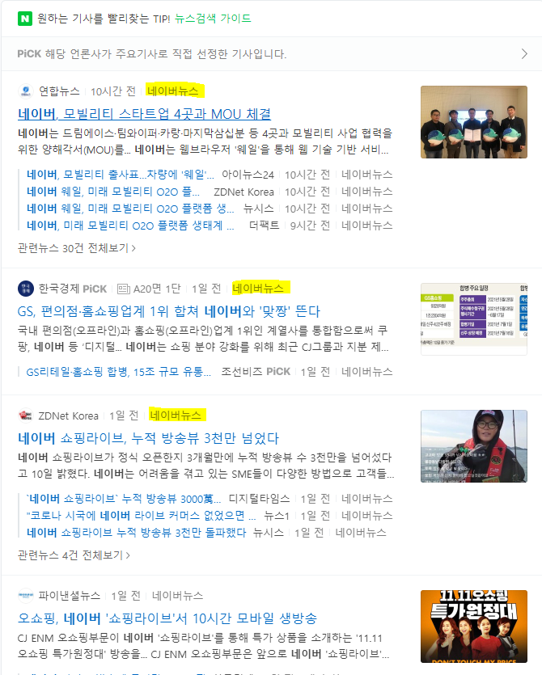

# NewsCrawler
- 자소서나 면접 준비할 때 해당기업의 기사를 읽어볼 필요가 있는데 일일히 클릭하고 지우고 하기가 힘들 것 같아서 만들어 봄. 
- 네이버 기사에서 긁어오는 형식인데, 검색어를 설정할 수 있음.
- 엑셀로 저장하기 때문에 해당 기업의 중요한 키워드가 들어간 기사를 고를 수 있음
## Overview
검색어에 따른 뉴스를 긁어오는 프로그램!!
### 만들게 된 계기
자소서나 면접 준비할 때 우리는 타겟으로 정한 기업에 대한 자료조사를 하게 된다. 보통 뉴스를 많이 보게 되는데 일일히 클릭하고 읽고 창닫고, 클릭하고 읽고 창닫고, 드래그해서 내용 복사/붙여넣기 하고 하는 것이 너무 귀찮을 것 같았다. 그래서 뉴스를 긁어오는 프로그램을 만들어 보기로 하였다.
##  Document
### Development Environment
- [Python 3.7 언저리 혹은 이상](https://www.python.org/) : 버전은 크게 상관없을 것으로 보이나 가능하면 최신 것(작성날짜 기준 3.9)의 0.1 ~ 0.2 낮은 것으로 하자(Python 3.7 or 3.8)
- Python Library
  - [requests](https://requests.readthedocs.io/en/master/)
    - http request 라이브러리
    - `pip install requests`로 설치 가능
  - [BeautifulSoup](https://www.crummy.com/software/BeautifulSoup/bs4/doc/#)
    - html 코드를 Python 객체 구조로 만들어 주는 오래된 라이브러리
    - `pip install bs4`로 설치 가능
  - [Pandas](https://pandas.pydata.org/)
    - Python의 데이터 분석 라이브러리
    - 딥러닝 공부할 때 많이 나온다
    - 해당 프로젝트에서는 excel 저장할려고 썼음
    - `pip install pandas`로 설치 가능(version은 크게 상관 없을 것으로 보임)

### Build and Run
- Python을 실행할 수 있다면 그대로 실행하면 됨
- Python을 실행할 수 없는 환경을 위해 exe 파일로 만들 예정
### Manual
- 콘솔창에서 `검색어를 입력하세요 : `가 뜨면 검색하고 싶은 검색어 입력
- 숫자 입력 칸에서 10개 단위로 가져올 기사 개수 입력(10의 배수) -> 수정 예정 
##  License
MIT License
## Contributing
- fora22@naver.com에 연락주세요~
- PR이나 issue도 괜찮습니다~
## Known issues

- 노란색 하이라이트 처럼 네이버뉴스 형태로 변환 가능한 뉴스만 긁어 올 수 있음